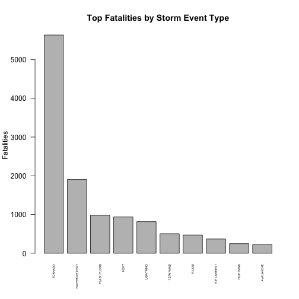
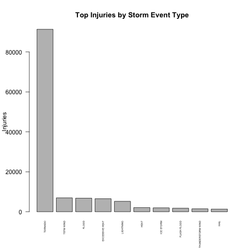
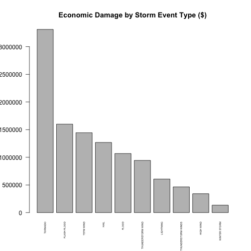

## Synopsis
This project involves an analysis of the U.S. National Oceanic and Atmospheric
Administration's (NOAA) storm database, which tracks characteristics of major
storms and weather events in the United States, including when and where they
occur, as well as estimates of any fatalities, injuries, and property damage. 
The recorded events in the storm database range from 1950 to 2011. 

The analysis attempts to answer two basic questions:

 1. Across the United States, which types of events are most harmful with
 respect to population health?

 2. Across the United States, which types of events have the greatest economic
 consequences?

--- .class #id 

## Top Fatalities By Storm Type

--- .class #id 

## Top Injuries By Storm Type

--- .class #id 

## Economic Damage By Storm Type

--- .class #id 

## Further Info:

[Full Study](https://rstudio-pubs-static.s3.amazonaws.com/205128_326b6141ebb5475cab611f0258d97c49.html)

